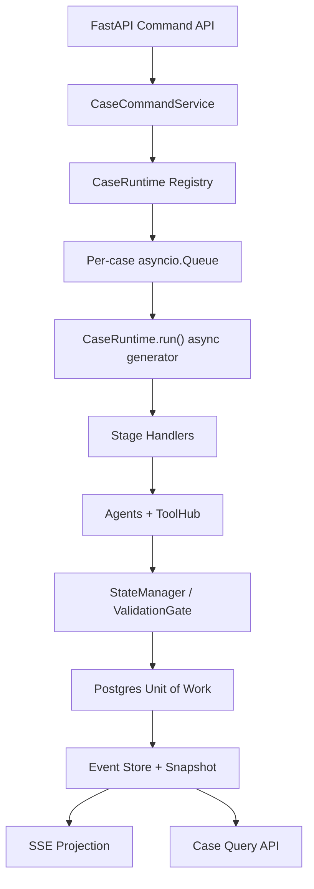

# Labour Lawsuit 案件级异步事件流架构迭代 Spec

> 状态：待实施
> 目标分支：`lbw`
> 基线提交：`311e9a8c7e3f3f722ca5c280c9b38a8635a3cd2e`
> 适用范围：当前仓库后端，以及后续恢复到仓库中的案件工作台前端
> 架构决策：采用“案件级异步事件流 + async generator 运行时”，而不是把 async generator 误当成全部业务架构

## 1. 决策摘要

本轮迭代要把当前同步、集中式的 `MultiAgentSessionService` 重构为可持续推进、可恢复、可审计的案件运行时。每个案件拥有一条严格串行的命令队列，用户消息、证据上传、事实确认、handoff 确认和文书请求先转成领域命令，再由 `CaseRuntime.run(case_id)` 以异步生成器形式持续产生领域事件。事件先持久化，再投影到 `CaseState`、消息视图和 SSE 输出；ControllerAgent、ScenarioAgent、LegalAnalysisAgent、EvidenceParser、RuleCalculator 及 ToolHub 都只能返回结构化结果或 `CasePatch`，不得绕过 `StateManager` 直接修改案件真相。

async generator 在本架构中的职责是统一“执行与增量产出”：同一条命令执行期间，可以依次 `yield` 出已接收、阶段开始、token 增量、工具调用、补丁提交、补丁生效、需要确认、产物生成和执行结束等事件。它不承担持久化真相、权限判断或法律规则；案件真相由版本化 `CaseState` 与 `StateManager` 负责，持久化顺序由 Repository/Unit of Work 负责，Agent 调度由 Controller 和各阶段 Handler 负责。

首版支持单个 FastAPI 进程内的多案件并发，每个 `case_id` 同时只允许一个消费者推进。这个运行边界必须在部署配置中明确为单 Uvicorn worker；不能在未实现跨进程命令认领前开启多个 worker。多实例不是用静默 fallback 解决，而是在后续显式升级为 Postgres 命令表 + `FOR UPDATE SKIP LOCKED`/advisory lock，或替换为 Redis Streams/NATS。首轮不得提前引入 Kafka。

## 2. 当前仓库真实基线

本 spec 以代码审计结果而非现有集成报告的勾选状态为准。当前仓库已经具备值得保留的领域骨架，但主流程尚未形成真正的事件驱动运行时。

| 现有能力 | 当前实现 | 结论与处理 |
|---|---|---|
| 案件状态 | `Agents/case_state.py` 中的 `CaseState` / `CaseWorkspace` dataclass | 保留五层语义，迁移为 Pydantic v2 强类型模型并补齐 schema version |
| 状态写入门 | `Agents/state_manager.py` 的 `apply_patch()`、版本检查和分层权限 | 保留并强化；删除无效的 `_set_path()` 测试缝，加入阶段迁移、引用完整性和幂等校验 |
| 事件结构 | `Agents/event_bus.py` 的 dict 事件和同步订阅回调 | 现有 `EventBus` 未接入生产主链路，只被测试使用；替换为 typed async event stream |
| 编排主链路 | `Agents/session_service.py` 中同步的 Controller → Scenario → Legal 分支 | 拆成 CommandService、CaseRuntime、StageHandler、Repository 和 QueryService |
| 流式输出 | API 在线程池执行同步流程，通过 `queue.Queue` 轮询 token | 替换为直接消费 async generator 的 SSE；不再以 50ms sleep 轮询线程队列 |
| 持久化 | 每次变化整份覆盖 `storage/sessions/{id}.json` | 开发导入兼容保留一次；正式写入迁移为 Postgres 事务中的事件表、快照表和投影视图 |
| LLM | 同步 OpenAI-compatible client + callback | 提供真正的异步流式 client；同步 client 只允许存在于有删除期限的迁移 adapter |
| MCP | `requests.Session` 同步调用，Scenario 内部循环重试 | ToolHub 改为异步端口；重试只对明确可重试的网络错误生效，业务错误立即失败并事件化 |
| 法律分析 | Scenario 输出自由 JSON，Legal 以其和拼接 history 为主输入 | 改为只从受控 CaseSnapshot、AuthorityRef、RuleResult、EvidenceRef 生成分析和文书 patch |
| 附件 | 上传落盘，但附件元数据与解析、证据状态未形成闭环 | 建立 EvidenceUploaded → EvidenceParsed → EvidencePatchApplied 完整链路 |
| 前端 | `AGENTS.md` 和报告声称存在 `jobpilot-front` | `lbw` 实际不包含前端目录；前端验收必须等源码恢复，禁止继续将 C 阶段标为完成 |
| RAG | API 尝试挂载 `rag_app` 并吞掉全部异常 | `lbw` 不包含 `rag_app`；删除宽泛异常吞并，能力未配置时在启动期明确暴露 |
| 依赖 | 启动脚本假设环境已安装 | 当前缺 `pyproject.toml`/锁文件，无法可靠复现；必须补齐 |
| 安全 | 公开仓库中存在硬编码凭据、会话快照和不安全文件名 | 在运行时重构前完成密钥撤销与历史治理；上传文件仅使用服务端 ID 和经过清洗的展示名 |

当前 `SYSTEM_INTEGRATION_REPORT.md` 将前端、RAG、附件解析和发布验收描述为已完成，与 `lbw` 文件树不一致。实施开始后应把它降级为历史报告，新的完成度以本 spec 的验收矩阵和自动化检查为准。

## 3. 产品目标与硬约束

系统要完成的不是一个“会聊天的劳动法机器人”，而是一个以案件为中心的持续工作台。用户可以在同一案件中补充事实、上传证据、确认冲突事实、触发检索和规则计算、查看争议焦点、确认 Agent handoff，并生成带事实版本和权威来源引用的法律分析或文书。任何中间结果都必须可追溯到 `case_id`、`command_id`、`event_id`、`causation_id`、`case_version` 和执行主体。

以下约束属于架构验收条件：Controller 是唯一用户对话路由者，但不得直接实施专业检索和法律结论；Scenario 负责场景事实抽取、证据任务规划和权威资料检索，不得写 confirmed fact；LegalAnalysis 只消费已确认/已标注状态的事实、证据引用、规则结果和权威资料，不得把推断写回事实层；所有状态写入必须通过 `StateManager`；一条案件命令必须在同一案件内串行执行，不同案件可以并行；SSE 断线不得取消已经被接受的案件命令，客户端可从最后事件序号恢复；协议错误必须显式失败，不得合成“看似可用”的 LLM 结果继续推进；不得以固定假响应、空实现、dummy handler 或大量 fallback 宣称功能完成。

## 4. 目标架构



API 层只负责鉴权、请求校验、命令创建与流式传输。`CaseCommandService` 把外部操作转换为领域命令并分配 `command_id`。`CaseRuntimeRegistry` 管理活跃案件的 queue、runner task、订阅者和生命周期；`CaseRuntime` 是唯一执行入口。各 Stage Handler 根据当前状态处理命令或派生事件，Agent 与 ToolHub 执行推理和 I/O，`StateManager` 校验 patch，Unit of Work 在单次事务中提交 patch 结果、案件版本、领域事件和必要快照。SSE 与查询 API 读取已经提交的事件和投影，不能把未提交 token 当成案件事实。

## 5. 领域模型

### 5.1 CaseState

`CaseState` 继续采用 interaction、facts、evidence、analysis、outputs 五层，但每层必须变成明确模型，不再使用无约束的 `dict[str, Any]`。建议核心字段如下：

| 层 | 必备对象 | 关键约束 |
|---|---|---|
| interaction | `stage`、`active_agent`、`current_goal`、`pending_questions`、`pending_confirmation`、`blocked_on` | stage 只能通过状态迁移表变更 |
| facts | `FactItem`、`FactConflict` | status 为 claimed/pending_verification/confirmed/inferred/disputed；confirmed 只能来自用户确认或可验证规则 |
| evidence | `EvidenceItem`、`EvidenceExtraction`、`FactEvidenceLink` | 原文件、解析文本、哈希、来源、真实性风险和关联事实分离保存 |
| analysis | `IssueCard`、`AuthorityRef`、`RuleResult`、`AnalysisNote`、`MissingInformation` | 每个结论必须列出 fact/evidence/authority 引用 ID |
| outputs | `OutputArtifact`、`ArtifactRevision` | 记录生成时 `case_version`，案件变更后可标记 stale，不能悄悄覆盖旧版本 |

所有模型必须包含 `schema_version`。从现有 JSON snapshot 读取时，只允许走一次性的、可测试的迁移函数；未知版本必须报错，不能按空案件读取。

### 5.2 命令

外部请求统一为 `CaseCommand`，至少包含 `command_id`、`case_id`、`actor_id`、`command_type`、`idempotency_key`、`expected_case_version`、`created_at` 和 typed payload。首轮必须实现以下命令：

| command_type | 来源 | 业务效果 |
|---|---|---|
| `submit_user_message` | 对话输入 | 追加用户消息，触发 Controller/当前阶段推进 |
| `register_evidence` | 文件上传完成 | 建立 EvidenceItem 并触发解析 |
| `confirm_fact` | 用户事实确认 | 将指定候选事实升级为 confirmed，或解决冲突 |
| `confirm_handoff` | 用户确认 | 执行或拒绝已存在的 pending transition |
| `request_analysis` | 工作台操作 | 在门禁通过后生成/更新争议分析 |
| `request_document` | 工作台操作 | 生成指定类型文书及 artifact revision |
| `cancel_operation` | 用户操作 | 取消仍在运行的 operation，不回滚已提交事件 |

重复 `idempotency_key` 必须返回同一 `command_id` 和既有结果，不能重复调用 LLM、MCP 或生成两份文书。

### 5.3 事件信封

禁止继续使用任意 dict 作为公共事件协议。统一事件信封建议如下：

```python
class EventEnvelope(BaseModel):
    schema_version: Literal["1.0"] = "1.0"
    event_id: UUID
    sequence: int
    case_id: UUID
    command_id: UUID
    correlation_id: UUID
    causation_id: UUID | None
    turn_id: int | None
    case_version: int
    event_type: str
    producer: str
    visibility: Literal["internal", "user"]
    occurred_at: datetime
    payload: dict[str, Any]
```

`sequence` 是案件内严格递增序号，也是 SSE 恢复游标。`case_version` 只在状态补丁成功后增加；token、阶段进度等瞬时事件不会随意改变案件版本。`visibility=internal` 的事件用于审计和派生，不能未经投影直接发给前端。

首轮事件字典必须冻结为以下集合：`command.accepted`、`command.rejected`、`operation.started`、`operation.completed`、`operation.failed`、`message.received`、`agent.stage_started`、`agent.token_delta`、`agent.output_received`、`tool.call_started`、`tool.call_completed`、`tool.call_failed`、`patch.submitted`、`patch.applied`、`patch.rejected`、`state.transitioned`、`clarification.requested`、`handoff.requested`、`handoff.confirmed`、`handoff.rejected`、`evidence.registered`、`evidence.parsed`、`fact.confirmation_requested`、`fact.confirmed`、`analysis.updated`、`artifact.generated`。新增事件必须先更新 schema 和兼容性测试。

## 6. CaseRuntime 与 async generator

`CaseRuntime` 不直接持有具体 FastAPI Response，也不把 SSE 字符串写进领域层。它接收命令、顺序处理并产出 `EventEnvelope`：

```python
class CaseRuntime:
    async def submit(self, command: CaseCommand) -> UUID: ...

    async def run(self) -> AsyncIterator[EventEnvelope]:
        while not self._closed:
            command = await self._queue.get()
            try:
                async for event in self._execute(command):
                    committed = await self._unit_of_work.commit_event(event)
                    await self._broadcast.publish(committed)
                    yield committed
            finally:
                self._queue.task_done()

    async def _execute(
        self,
        command: CaseCommand,
    ) -> AsyncIterator[EventEnvelope]: ...
```

真正实现时，状态改变事件不能逐条先写后改导致半完成。Handler 应先产生 `ExecutionBatch`，其中包含预期版本、patch、状态改变事件和投影更新，Unit of Work 原子提交后，再把 committed event 逐个 yield 给订阅者。token delta 可以作为非状态事件批量持久化，避免每个 token 一次数据库事务；建议以 50–100ms 或 256–512 字符合并，但不得改变文本顺序。

`CaseRuntimeRegistry` 为每个活跃案件维护一个 queue 和一个 runner。`get_or_create(case_id)` 必须受 registry lock 保护，避免同一案件创建两个 runner。queue 设置容量上限，例如 64；满载时 API 返回 429/409 和明确的 `case_busy` 错误，而不是无限堆积。案件无活动且 queue 为空一段时间后可以回收内存对象，状态从 Repository 重建。FastAPI shutdown 时停止接受新命令，等待在执行命令完成或到达明确超时，再取消 runner。

SSE 客户端只是事件订阅者。客户端断开时，只取消该订阅，不取消已被 `command.accepted` 的执行任务。客户端使用 `Last-Event-ID` 或 `after_sequence` 先补发 Postgres 中的已提交用户可见事件，再订阅实时广播，从而避免查询历史与订阅实时事件之间的空窗。

## 7. 调度语义与 Agent 边界

### 7.1 ControllerAgent

Controller 每次处理前读取 `CaseSnapshot`，输出 typed `ControllerDecision`，其决策仅允许为 `ask_clarification`、`route_scenario`、`request_fact_confirmation`、`request_analysis`、`request_document` 或 `continue_current_stage`。现有“三轮追问后合成一个默认 dispute_arbitration 分析包”的逻辑必须删除，因为它会在信息不足时伪造业务路由。达到追问上限时，应输出 `clarification.requested` 并允许用户选择“基于现有信息继续（明确低置信度范围）”或补充信息；若路由所需字段仍缺失，命令以 blocked 状态结束。

### 7.2 ScenarioAgent

Scenario 接收场景 ID、允许读取的 CaseSnapshot 和明确任务，输出 `ScenarioResult`：候选事实、缺失事实问题、证据需求、检索计划、规则计算请求和 scene confidence。检索计划交给 ToolHub 执行，结果以 `AuthorityRef`/`ToolResultRef` 存储，Scenario 不得把长篇工具原文直接塞入 conversation history。所有工具结果必须记录工具名、规范化查询、返回时间、来源标识、内容哈希和解析状态。

当前场景目录与模板覆盖不一致。实施时必须先补齐或明确移除无模板场景；`_resolve_scenario_template()` 不得退回不匹配的通用模板。模板缺失属于启动期配置错误。

### 7.3 LegalAnalysisAgent

LegalAnalysis 的输入只能由 `LegalAnalysisContextBuilder` 从状态中构造，包含 confirmed/user_claimed/inferred/disputed 的明确分区、EvidenceRef、AuthorityRef、RuleResult、争议焦点和输出类型。输出为 typed `LegalAnalysisResult` 或 `DocumentDraftResult`，每个 issue/conclusion 必须声明所依据的 `fact_ids`、`evidence_ids` 和 `authority_ids`。引用不存在、引用状态不允许或权威资料解析失败时，ValidationGate 拒绝 patch。

LegalAnalysis 可以提出待确认事项，但不能通过自然语言偷偷改变事实。报告生成后以 `OutputArtifact` 新版本写入；案件事实版本变化时，系统计算受影响引用并把旧报告标记为 `stale`，由用户显式请求重新生成。

### 7.4 ToolHub、EvidenceParser 与 RuleCalculator

ToolHub 提供统一异步端口，MCP、RAG、OCR、文件解析和规则计算分别实现 adapter。接口返回结构化结果，不返回混杂的 Markdown history。同步第三方 SDK 可以在 adapter 内使用 `asyncio.to_thread` 过渡，但 adapter 必须具备超时、取消、错误分类和删除期限；业务层不得出现 thread pool、`requests` 或 callback。

重试策略只覆盖连接中断、429 和明确的 5xx，采用有上限的指数退避并记录每次 attempt。400、401、schema mismatch、空权威来源等不可重试错误立即失败。禁止“工具失败后让 LLM 凭印象继续回答”。当必要权威检索失败时，本次 analysis/document command 失败并保留已完成的事实和证据处理事件。

EvidenceParser 必须按 MIME/扩展名双重校验，计算 SHA-256，隔离保存原文件，抽取文本后生成证据候选与事实链接。上传文件名只作为展示元数据，磁盘/对象存储键必须完全由服务端生成。OCR/解析失败产生 `tool.call_failed`/`operation.failed`，不将空文本登记为已解析证据。

RuleCalculator 使用现有 `LabourCalculatorEngine` 的确定性能力，但输入必须来自显式命令或可追溯事实映射，输出包含输入事实版本、适用规则、结果、单位、舍入策略和错误。计算结果写 analysis 层，不直接成为法律结论。

## 8. StateManager 与 ValidationGate

`StateManager` 仍是唯一状态写入口，必须实现以下顺序：解析 typed patch；验证 `base_version`；验证 producer 权限；验证操作和路径；验证状态迁移；验证事实状态升级来源；验证 ID 引用完整性；检测冲突；在内存副本上应用；运行 CaseState 全量 schema 校验；生成新版本与派生事件；交给 Unit of Work 原子提交。任何一步失败都不得部分修改 live state。

patch 操作收敛为领域动作，避免任意字符串路径成为公共接口：

```python
CasePatchOperation = (
    SetInteraction
    | UpsertFact
    | ResolveFactConflict
    | RegisterEvidence
    | LinkEvidenceToFact
    | UpsertIssue
    | AddAuthority
    | AddRuleResult
    | AddArtifactRevision
)
```

阶段迁移表至少包括 `intake → fact_collecting → evidence_processing → analysis_ready → analyzing → document_ready → completed`，并允许从 analysis/document 阶段因新增事实退回 `fact_collecting` 或 `analysis_ready`。handoff 是阶段迁移的门禁条件，而不是另一个与 stage 并列、可能互相矛盾的 `pending_stage` 字符串。

用户确认事实使用专门 `confirm_fact` 命令，由 `StateManager` producer 权限执行。Agent 只可创建 claimed、pending_verification 或 inferred；inferred 必须含推导依据和 confidence。冲突事实不能通过后来写入覆盖，必须创建 `FactConflict` 并阻塞依赖该事实的分析。

## 9. 持久化与事务

Postgres 是正式存储，推荐使用 SQLAlchemy 2 async + asyncpg，迁移使用 Alembic。首轮核心表如下：

| 表 | 用途 |
|---|---|
| `cases` | 案件元数据、角色、当前版本、stage、owner、创建更新时间 |
| `case_commands` | 幂等命令、状态、错误、开始完成时间 |
| `case_events` | append-only 事件，`(case_id, sequence)` 唯一 |
| `case_snapshots` | 版本化 CaseState JSONB 快照，含 schema version |
| `messages` | 用户/Agent 消息投影，关联 command/event |
| `evidence_files` | 文件元数据、存储键、哈希、解析状态 |
| `artifacts` | 文书与分析产物的版本、引用和 stale 状态 |

一次状态变更事务必须锁定 `cases` 当前行，校验 expected version，写入 patch 对应事件与新 snapshot，更新 `cases.current_version`，写入投影和 outbox/notification。只有事务提交成功的事件才能进入 SSE。事件表是审计记录，不要求把所有状态完全 event-source 重放；snapshot 是运行时恢复的主读取模型，事件用于审计、续传和派生。这样避免首轮把项目升级成完整 Event Sourcing 框架。

现有 `storage/sessions/*.json` 只用于一次性迁移工具，不能继续被应用进程覆盖。迁移脚本要逐文件校验、输出导入报告，并默认跳过已导入的 session id；仓库中真实会话文件应停止追踪，并评估是否包含敏感信息后清理 Git 历史。

## 10. API 与 SSE 契约

建议保留 `/api/v1` 前缀，但把“提交并等待整个同步结果”的语义改为命令与事件语义：

| 方法与路径 | 作用 | 成功结果 |
|---|---|---|
| `POST /cases` | 创建案件 | 201 + case summary |
| `GET /cases/{case_id}` | 读取案件投影 | 当前 version、stage、pending action |
| `POST /cases/{case_id}/commands` | 提交 typed command | 202 + command_id/operation_id |
| `GET /cases/{case_id}/events` | SSE 事件流 | 支持 `Last-Event-ID`/`after_sequence` |
| `GET /cases/{case_id}/events/history` | 分页审计事件 | 用户有权查看的 committed events |
| `POST /cases/{case_id}/evidence` | 流式上传并创建 register_evidence 命令 | 202 + evidence_id/command_id |
| `GET /cases/{case_id}/artifacts` | 获取产物版本列表 | artifacts projection |
| `GET /cases/{case_id}/artifacts/{artifact_id}` | 下载/查看指定版本 | 受权内容 |

为了降低前端一次迁移成本，现有 `/sessions/{id}/turns/stream` 可以短期作为 compatibility route，但它必须调用同一个 `CaseCommandService` 和事件流，不能保留旧的同步业务主路径。兼容 route 在前端迁移完成后删除，删除条件和目标版本写入 changelog。

SSE 用户可见事件统一为：

```text
id: <case sequence>
event: <event_type>
data: <EventEnvelope JSON>
```

心跳使用 SSE comment，不写事件表。错误不能只返回字符串，统一包含 `code`、`message`、`retryable`、`command_id`、`case_id` 和可选 field errors。认证/授权错误通过 HTTP 状态处理；已接受命令的后续失败通过 `operation.failed` 事件报告。

## 11. 安全与配置前置条件

当前公开仓库中的所有硬编码 API/MCP 密钥必须视为已泄露并撤销。新代码只从环境变量或 secret manager 读取，缺失时应用启动失败并列出缺失键名，不能带默认密钥。`start_project.sh`、`Agents/llm_call.py`、`utils/pkulaw_mcp_client.py` 中不得留下真实 token、注释副本或可用默认值。

API 至少实现案件所有权鉴权，任何 list/get/delete/events/artifact 接口都按 `actor_id/tenant_id` 过滤。上传必须阻止路径穿越、限制大小和 MIME、使用服务端存储键，并为后续恶意文件扫描保留状态。事件和日志不能记录完整 secret，也不能默认记录整份敏感原文；工具原始响应进入受控存储，用户事件只返回摘要和引用 ID。

## 12. 代码落位

为避免继续扩大 `session_service.py`，目标目录建议调整为：

```text
Agents/
  api/
    routes_cases.py
    routes_commands.py
    routes_events.py
    routes_evidence.py
    schemas.py
  application/
    command_service.py
    query_service.py
    handlers/
      intake.py
      scenario.py
      evidence.py
      legal_analysis.py
      document.py
  domain/
    commands.py
    events.py
    case_state.py
    patches.py
    state_manager.py
    transitions.py
  runtime/
    case_runtime.py
    registry.py
    broadcast.py
  infrastructure/
    database.py
    repositories.py
    unit_of_work.py
    llm_adapter.py
    mcp_adapter.py
    evidence_storage.py
    migrations/
  services/
    tool_hub.py
    context_builders.py
```

现有 `Agent`、`ScenarioAgent` 和 `LegalAnalysisAgent` 可先保留推理与 payload 解析代码，但会由 application handler 调用；完成迁移后删除它们对 conversation list、MCP client 和 callback 的直接持有。`MultiAgentSessionService` 在兼容 API 迁移完成后删除，不形成新旧双主链路。

项目根目录补齐 `pyproject.toml`、锁文件、`.env.example`、`.gitignore`、Alembic 配置和明确启动命令。依赖至少覆盖 FastAPI、Uvicorn、Pydantic v2、SQLAlchemy 2、asyncpg、Alembic、httpx、python-multipart、测试异步支持和静态检查；版本必须锁定。

## 13. 实施顺序

### M0：可信基线与可复现环境

先撤销并移除硬编码凭据，停止追踪运行时 session/upload，补齐依赖与环境示例，修复上传路径，更新失真的集成报告状态。完成标志是全新环境可按 README 安装并启动，缺配置时明确失败，仓库不再包含可用 secret，现有真实测试可以稳定执行。M0 不做业务 fallback。

### M1：强类型领域契约与原子 StateManager

建立 `domain/commands.py`、`events.py`、typed `CaseState`、领域 patch、状态迁移表和内存副本校验；提供现有 snapshot → schema v1 的显式迁移。完成标志是现有状态能力迁移完成，所有 patch 均为 all-or-nothing，事实冲突、过期版本、越权引用和非法阶段迁移都有真实断言。

### M2：Postgres Repository 与事件提交

加入 SQLAlchemy async、Alembic、Unit of Work 和核心表，实现创建案件、命令幂等、案件序号、snapshot、event append、消息/产物投影。完成标志是进程重启后可恢复案件，重复 command 不重复副作用，事务故障不会出现“状态已改但事件未写”或反向不一致。

### M3：案件级 CaseRuntime

实现 registry、per-case bounded queue、runner、broadcast 和 async generator，先迁移 `submit_user_message`、`confirm_handoff` 两条主命令。完成标志是同一案件两个并发消息严格按序，不同案件可以并发推进，SSE 断线重连可从 sequence 恢复，当前线程池轮询链路被移除。

### M4：Controller 与 Scenario 完整迁移

实现 typed ControllerDecision、ScenarioResult、模板完整性启动校验、异步 LLM adapter、ToolHub 和权威检索结果模型；删除三轮追问后的合成分析 fallback。完成标志是 intake → clarification 或 handoff → scenario → authority retrieval 的业务路径能以真实事件推进，MCP 失败不会产生无依据结论。

### M5：证据、规则与事实确认闭环

实现文件登记、解析、哈希、证据事实链接、冲突事实确认和 RuleCalculator command。完成标志是用户上传劳动合同/工资材料后能看到解析状态、候选事实及确认动作，确认后 case version 更新，依赖旧事实的分析被正确标记需刷新。

### M6：LegalAnalysis 与文书产物

实现受控 context builder、引用验证、争议焦点、分析更新和文书 artifact revision。首批文书至少完成“法律分析报告”和“劳动仲裁申请书”，不是只创建通用 Markdown 占位模板。完成标志是每项结论可追溯到事实、证据和权威来源，新增事实后旧产物 stale，新产物保留版本历史。

### M7：API 收敛与前端工作台

将现有 route 迁移到 command/SSE/query 契约，恢复并接入真实前端源码，完成对话区、事实确认区、证据区、争议焦点区、文书区和运行状态区。完成标志是前端不生成业务结论、不展示裸内部 JSON，可处理重连、pending action、失败事件和产物版本。若前端源码尚未恢复，本阶段不得打勾。

## 14. 测试与验收策略

测试用于证明业务完成，而不是代替业务完成。允许 mock 的位置仅限单元测试中的不可控外部边界，但一项能力不能只靠 FakeLLM/FakeMCP 返回预制成功 JSON 验收。每个里程碑必须包含相应层级的真实验证：

| 层级 | 必须验证 | 不接受 |
|---|---|---|
| 领域测试 | patch 原子性、权限、冲突、迁移、引用完整性、幂等 | 只断言函数被调用 |
| Runtime 并发测试 | 同案有序、跨案并发、取消、backpressure、shutdown | sleep 后猜测顺序 |
| Repository 集成测试 | 真实 Postgres 事务、唯一约束、恢复、重复命令 | 用 dict 仿造数据库 |
| API 集成测试 | 真实 FastAPI ASGI、SSE sequence/恢复、错误结构、鉴权 | 只测 200 状态 |
| Tool adapter 合约测试 | 真实协议样本、schema、超时和错误分类 | 空字符串或永远成功的 dummy 工具 |
| 业务场景验收 | 基于审校过的劳动争议案例 fixture 跑完整事实—证据—检索—分析—文书链 | 仅用“x”“test”作为法律事实 |
| Staging smoke | 使用受控测试账号真实调用 LLM/MCP/OCR | 用本地假响应宣称外部能力完成 |

首批端到端验收案例选择一个完整但去身份化的违法解除争议：用户主张绩效不合格被口头辞退、无书面通知、存在加班费、工作地与合同签订地不同。验收必须覆盖追问、scene 路由、劳动合同与工资证据、事实冲突确认、法条/案例检索、赔偿计算、争议焦点、法律分析报告和仲裁申请书生成。该案例 fixture 是领域验收材料，不是线上结论金标准；涉及动态法源的部分必须在 staging 使用真实检索复核。

## 15. Definition of Done

一个里程碑只有在代码、迁移、测试、运行文档和观测事件同时完成时才算完成。核心完成条件如下：业务主路径只有一条，不存在同步旧链路和异步新链路同时写状态；所有 accepted command 最终都有 completed/failed/cancelled 终态；状态变更和事件提交原子一致；同案串行和幂等有数据库与并发测试证据；用户能确认事实、看到证据解析、查看引用、生成并版本化文书；LLM/MCP/OCR 失败被明确暴露且不生成无依据结果；公开仓库无可用 secret 和真实会话快照；后端测试全绿，前端源码存在时 build/lint 全绿；README 与部署约束真实可复现。

## 16. 明确不做

首轮不引入 Kafka、复杂微服务拆分、通用工作流 DSL、自研向量数据库或为了“看起来智能”增加更多 Agent。首轮不做自动提交仲裁、代替律师给出确定胜诉承诺，也不把未经用户确认的推断包装成案件事实。首轮不保留无限期 compatibility route，不用通用模板覆盖缺失场景，不在外部工具失败时让 LLM 自行补全权威依据。

## 17. 首个开发切片

实施应从 M0 + M1 开始，但第一个可演示纵切片必须尽快贯通：`submit_user_message` 命令进入 per-case queue，`CaseRuntime.run()` 产生 committed events，Controller 返回追问或 handoff decision，StateManager 原子更新 interaction/facts，SSE 以 sequence 推给客户端，进程重启后可从 Postgres snapshot 恢复并从上一 sequence 续传。这个切片完成后再迁移 Scenario 和 Legal，避免一次性重写 1938 行 service 后无法验证，同时也避免以空 handler、假 Agent 或仅有接口骨架冒充异步架构完成。
